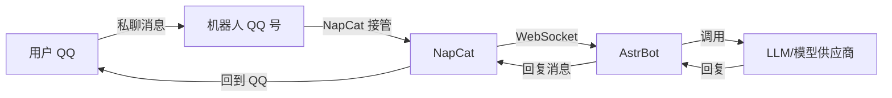

# AI 机器人云服务器搭建（AstrBot + NapCat + QQ）

前阵子出了一个很火的 AI 智能体 OpenClaw，网上把它的能力吹得很夸张。实际了解后我发现：AI 时代很多产品并没有想象中“全能”，它更像是一种更智能的工具。于是我决定用国内大佬开源的 AstrBot，在 QQ 上部署一个可用的 AI 机器人，记录一下完整过程。

AstrBot 是 AGPLv3 许可证下的免费开源项目，集成多种即时通讯平台、LLM、插件与各类 AI 能力的 Agentic 聊天机器人平台。配合 NapCat（基于 TypeScript 的 Bot 框架，提供 OneBot/QQ 相关能力）就可以在 QQ 上实现“私聊机器人 → 大模型回复”的链路。

## 整体架构与数据流

大致流程：
- NapCat 登录一个“机器人 QQ 号”，并接管该账号
- NapCat 创建 `WebSocket 客户端`，对接 AstrBot 的 OneBot/适配器
- AstrBot 配置模型供应商与模型（如 OpenRouter），负责对话与回复

用 Mermaid 画出来大概是这样：



## 参考链接

- 部署流程参考视频：[【AstrBot×雨云】最新免费QQ机器人部署超详细教程](https://www.bilibili.com/video/BV1upfcBYEK2/?spm_id_from=333.337.search-card.all.click&vd_source=11734be81396b0b99bb97a3048eeb2cd)
- NapCat 安装文档：[Shell | NapCatQQ](https://napneko.github.io/guide/boot/Shell)
- AstrBot 配置参考视频：[Astrbot 配置教程](https://www.bilibili.com/video/BV1T3fPBBECu/?spm_id_from=333.1387.homepage.video_card.click)

## 1. 云服务器怎么选（踩坑经验）

第一次买云服务器时我重点关注了这几项：

1) **机房位置 / 网络环境**  
我更推荐海外服务器：很多 Agent/搜索相关能力依赖外网环境，国内网络可能会导致某些功能异常（后面我就遇到了）。

2) **CPU/内存**  
轻量使用一般 `2 核 2GB` 就能跑起来；想更稳可以上更高配置。

3) **公网独立 IP（强烈建议）**  
有独立公网 IP 会省很多事：直接访问面板、直接放行端口。  
如果没有独立 IP，通常需要 **NAT 端口映射**（也能用，但配置会更绕）。

下面是我当时选的配置：之所以写出来，是因为我踩了“不是海外 IP + 没有独立 IP”的坑，后面排查问题会更麻烦一些。


## 2. 选择系统与预装软件（宝塔 + Debian + AstrBot）

我选了宝塔面板的 Debian 12，并预装 AstrBot。宝塔面板本质上是一个“服务器可视化管理面板”，把很多运维操作（建站、装环境、管数据库、配证书等）做成网页点点鼠标就能完成，适合快速把服务先跑起来。

## 3. 端口映射（无独立 IP 场景）

如果你的服务器没有独立公网 IP，需要在 NAT 端口映射里把内网端口映射到外网端口，才能从外网访问。

我当时用到的端口大致是：
- `22`：SSH 远程登录
- `8889`：宝塔面板
- `AstrBot`：以面板/配置里显示的监听端口为准（下文示例内网是 `6199`）
- `NapCat`：以 NapCat 的实际端口为准（示例外网映射后访问）

外网端口可以自定义，关键是把“外网端口 → 对应的内网端口”映射对。


测试阶段我建议先在宝塔里把防火墙关掉，先把链路打通；等确认一切正常后，再把防火墙/安全组规则补齐（只放行必要端口）。


## 4. 安装并启动 NapCat

NapCat 需要通过 SSH 登录服务器单独安装，按官方文档选择：
- `NapCat.Installer` → `Linux` 一键脚本（支持 Ubuntu 20+/Debian 10+/CentOS 9）

安装完成后，输入下面命令启动 NapCat（示例）：

```shell
Xvfb-run -a /root/Napcat/opt/QQ/qq --no-sandbox
```

正常启动后会看到类似下面的界面（注意显示的 `token` 和访问地址/端口，后面要用）：


我这里端口已经做了映射，所以可以直接用“映射后的外网地址”打开管理页：


输入 `token` 后进入登录页：


登录你要作为“机器人”的 QQ 号，成功后界面如下：


## 5. NapCat 新建 WebSocket 客户端（对接 AstrBot）

进入 NapCat 的网络配置，选择新建 `WebSocket 客户端`：


这里的地址/端口对应 **AstrBot 的内网监听端口**。因为 NapCat 和 AstrBot 在同一台服务器/同一内网下，所以要填内网端口（我这里示例是 `6199`）。同时把生成的 `Token` 保存好，AstrBot 端要用。


到此 NapCat 侧基本配置完毕，下面开始配置 AstrBot。

## 6. 配置 AstrBot（OneBot + 模型供应商）

进入 AstrBot 面板，主要做两件事：
- 配置平台机器人（OneBot）
- 配置 AI 模型（供应商 + 具体模型）


### 6.1 创建平台机器人（OneBot）

创建机器人，消息平台类别选 `OneBot`，把 NapCat 生成的 `Token` 填进去（其余配置按面板提示/示例图配置）。


保存后看平台日志，正常情况下会提示适配器已连接：


### 6.2 配置模型供应商与模型

我这里用的是 OpenRouter，你也可以根据自己的习惯选择其它供应商与模型：


模型选择完成后一般就可以用了。除此之外，AstrBot 的“普通配置/配置文件”里还有不少可调项（我也没完全吃透），我主要参考了下面的视频按需做了一些增强配置：

[Astrbot 配置教程](https://www.bilibili.com/video/BV1T3fPBBECu/?spm_id_from=333.1387.homepage.video_card.click)

## 7. 验证效果与坑点

配置保存后，用另一个 QQ 号私聊这个“机器人 QQ 号”，就能看到回复效果：


我这里出现过“查询天气异常”，核心原因是服务器网络环境在国内，访问 Google 等服务会异常，导致部分能力不可用。预算足够的话，确实更建议直接上海外服务器，省心很多。  
