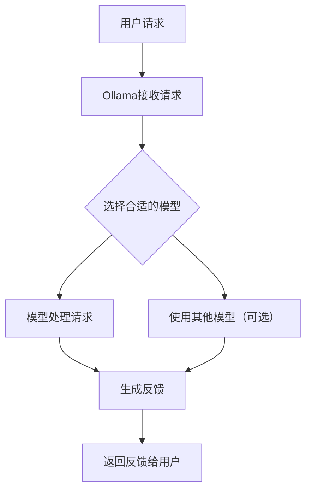

# 前言
最近由于 deepseek 的火爆，AI 大语言模型又一次被抬了出来，对此早有关注的我决定尝试本地化部署使用体验一下，并且搭建一个本地的 AI 助手。
根据我之前了解到的信息，在使用大模型，现在较为方便的方法一般是先搭建一个大模型的管理工具，工具主要可以管理，训练，微调和部署生成式 AI，并且支持不同模型架构的大模型，这里我选择使用热度最高的 Ollama 作为管理工具，该工具与模型的关系如下所示：

接下来主要介绍下如何安装和使用该工具。
# Ollama 安装过程
这里展示两个平台的安装方式
- **Windows**
 进入官网直接下载 exe 安装包安装即可，这里不再过多说明
 - **Linux**
使用命令行进行安装，安装命令
```cmd
curl -fsSL https://ollama.com/install.sh | sh
```
安装完成后打开 ollama 会自动运行，在终端输入 `ollama -v`，返回 ollama 安装版本号即安装完成。
# Ollama 相关配置说明
完成安装后，只需要拉取模型就可以正常的运行模型了，但在此之前，我们先将其内部参数进行设置一下，这里会将所有的命令参数都说明一遍，重要必须配置的参数这里会着重说明，部分参数可以看自身情况进行配置。
## 1. Ollama 可配置环境变量

> [!NOTE]
> 所有的环境变量均可以在 GitHub 源码 cmd. Go 中找到，后面版本更新可能会导致这里有些变化，当前介绍的是 V 0.5.12 版本。

| 命令                           | 功能                                                                                                                                                                                   |
| :--------------------------- | :----------------------------------------------------------------------------------------------------------------------------------------------------------------------------------- |
| **OLLAMA_DEBUG**             | 启用额外的调试信息。默认为 `false`。开启此变量可以获取更多的调试日志，帮助排查问题，例如 `OLLAMA_DEBUG=1` 可以启用调试模式。                                                                                                          |
| **OLLAMA_HOST**              | 定义 Ollama 服务器的协议和主机地址。默认为 `127.0.0.1:11434`，仅本机地址可通过 11434 端口访问该服务。可以通过此变量自定义 Ollama 服务的监听地址和端口，例如设置为 `0.0.0.0:8080` ，可允许其他电脑访问 Ollama（如：局域网中的其他电脑）。                                 |
| **OLLAMA_KEEP_ALIVE**        | 控制模型在内存中的存活时间。默认为 5 分钟。负值表示无限存活，0 表示不保持模型在内存中。此变量用于优化模型加载和运行的性能，例如 `OLLAMA_KEEP_ALIVE=30m` 可以让模型在内存中保持 30 分钟。                                                                        |
| **OLLAMA_MAX_LOADED_MODELS** | 限制同时加载的模型数量。默认为 0，表示不限制。此变量用于合理分配系统资源，避免过多模型同时加载导致资源不足，例如 `OLLAMA_MAX_LOADED_MODELS=4` 可以限制同时加载 4 个模型。                                                                               |
| **OLLAMA_MAX_QUEUE**         | 设置请求队列的最大长度。默认为 512。此变量用于控制并发请求的数量，避免过多请求同时处理导致服务过载，例如 `OLLAMA_MAX_QUEUE=1024` 可以将队列长度设置为 1024。                                                                                      |
| **OLLAMA_MODELS**            | 指定模型文件的存储路径。默认为用户主目录下的 `.ollama/models` 文件夹。通过设置此变量，可以自定义模型文件的存储位置，例如 `OLLAMA_MODELS=/path/to/models` 将模型存储在指定的路径下。                                                                  |
| **OLLAMA_NUM_PARALLEL**      | 设置同时处理的并行请求数量。默认为 0，表示不限制。此变量用于优化服务的并发处理能力，例如 `OLLAMA_NUM_PARALLEL=8` 可以同时处理 8 个并行请求。                                                                                                |
| **OLLAMA_NOPRUNE**           | 在启动时不清理模型文件。默认为 `false`。启用此变量可以保留所有模型文件，避免不必要的清理操作，例如 `OLLAMA_NOPRUNE=1` 可以禁用模型文件的清理。                                                                                                |
| **OLLAMA_ORIGINS**           | 配置允许跨域请求的来源列表。默认包含 `localhost`、`127.0.0.1`、`0.0.0.0` 等本地地址以及一些特定协议的来源。通过设置此变量，可以指定哪些来源可以访问 Ollama 服务，例如 `OLLAMA_ORIGINS=*,https://example.com` 允许所有来源以及 `https://example.com` 的跨域请求。 |
| **OLLAMA_SCHED_SPREAD**      | 允许模型跨所有 GPU 进行调度。默认为 `false`。启用此变量可以提高模型运行的灵活性和资源利用率，例如 `OLLAMA_SCHED_SPREAD=1` 可以启用跨 GPU 调度。                                                                                        |
| **OLLAMA_TMPDIR**            | 临时文件的位置                                                                                                                                                                              |
| **OLLAMA_FLASH_ATTENTION**   | 启用实验性的 Flash Attention 特性。默认为 `false`。此变量用于测试和使用新的注意力机制特性，例如 `OLLAMA_FLASH_ATTENTION=1` 可以启用 Flash Attention。                                                                        |
| **OLLAMA_KV_CACHE_TYPE**     | K/V 缓存的量化类型（默认：f16）                                                                                                                                                                  |
| **OLLAMA_LLM_LIBRARY**       | 设置 LLM 库以绕过自动检测。                                                                                                                                                                     |
| **OLLAMA_GPU_OVERHEAD**      | 为每个 GPU 预留的显存（以字节为单位）。默认为 0。此变量用于确保每个 GPU 有一定的显存余量，避免显存不足导致的问题，例如 `OLLAMA_GPU_OVERHEAD=1073741824` 可以为每个 GPU 预留 1 GB 的显存。                                                            |
| **OLLAMA_LOAD_TIMEOUT**      | 设置模型加载过程中的超时时间。默认为 5 分钟。0 或负值表示无限超时。此变量用于防止模型加载过程过长导致服务无响应，例如 `OLLAMA_LOAD_TIMEOUT=10m` 可以将超时时间设置为 10 分钟。                                                                            |
| **HTTP_PROXY**               | 设置 HTTP 代理服务器地址。此变量用于配置 Ollama 在进行 HTTP 请求时使用的代理服务器，例如 `HTTP_PROXY=http://proxy.example.com:8080` 可以让 Ollama 使用指定的 HTTP 代理。                                                          |
| **HTTPS_PROXY**              | 设置 HTTPS 代理服务器地址。此变量用于配置 Ollama 在进行 HTTPS 请求时使用的代理服务器，例如 `HTTPS_PROXY=https://proxy.example.com:8080` 可以让 Ollama 使用指定的 HTTPS 代理。                                                     |
| **NO_PROXY**                 | 设置不使用代理的地址列表。此变量用于指定哪些地址在进行请求时不使用代理，例如 `NO_PROXY=localhost,example.com` 可以让 Ollama 在访问 `localhost` 和 `example.com` 时不使用代理.                                                           |
## 2. Ollama 终端控制命令
| 命令 | 用途 |
| ------------------------- | ----------------------- |
| ollama serve | 在本地系统上启动 Ollama。 |
| ollama create <new_model> | 从现有模型创建一个新模型，用于定制或训练。 |
| ollama show < model > | 显示特定模型的详细信息，例如其配置和发布日期。 |
| ollama run < model > | 运行指定的模型，使其准备好进行交互。 |
| ollama pull < model > | 将指定的模型下载到您的系统。 |
| ollama list | 列出所有已下载的模型。 |
| ollama ps | 显示当前正在运行的模型。 |
| ollama stop < model > | 停止指定的正在运行的模型。 |
| ollama rm < model > | 从您的系统中移除指定的模型。 |
## 3. Ollama 初始设置
#### 1. **Windows 配置**
找到系统的环境变量设置的地方，添加系统进系统变量。

这里说明几个需要配置的
- OLLAMA_HOST ： 0.0.0.0:11434
- OLLAMA_MODELS : 选择一个存储地址，最好是固态硬盘
- HTTP_PROXY / HTTPS_PROXY / NO_PROXY : 根据自己网络情况挂代理
- OLLAMA_KEEP_ALIVE ：这里可以设置成 1 h 提高短时间内响应及时率
配置完成后重启启动 ollama 软件即可
#### 2. **Linux 配置**
Liunx 下，安装完成 ollama 后，配置文件位于 `/etc/systemd/system/ollama.service`，我们使用 `vim` 打开并修改。
```cmd
sudo vim /etc/systemd/system/ollama.service
```
打开 `vim` 后键盘按 **A** 开始修改文件
```
[Service]
Environment="OLLAMA_HOST=0.0.0.0:11434"
Environment="OLLAMA_KEEP_ALIVE=1h"
```
部分配置按需求添加，配置完成后保存并退出。
输入下面指令载入并重启 ollama：
```cmd
sudo systemctl daemon-reload
sudo systemctl restart ollama
```
到此初始配置完成。
## 4. 运行模型
访问 [Ollama Search](https://ollama.com/search)，这里是 ollama 的官网，官方提供的可以直接下载的模型都在这里，可以选择任意一个然后，用提供的指令直接下载并运行。


